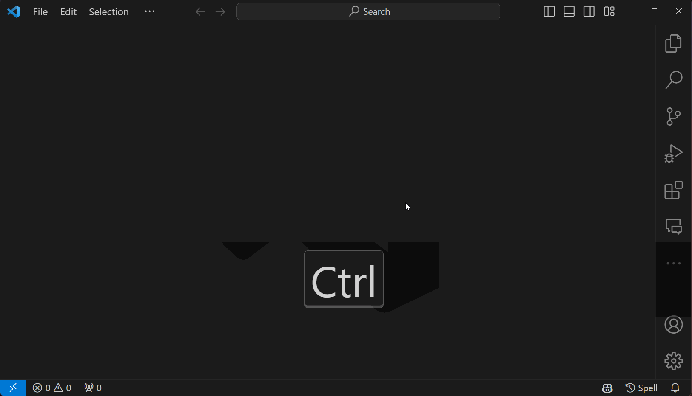
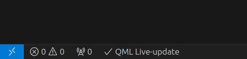

# QML Sandbox extension for Visual Studio Code

Welcome to QmlSandboxExtension, a specialized tool designed to streamline
the development process for QML experiments. This extension allows you
to preview your QML files directly within Visual Studio Code, eliminating
the need for context switching and enhancing your productivity.

## Quick start

To get started:

1. Open or create a file with QML content
1. Check at the bottom right corner that `QML` language is detected properly
1. Click on the `eye` icon appeared at the top right corner of your QML file or
 press `Ctrl+Shift+Q` to open the preview window

## Features

- **Preview QML:** This extension allows you to preview standalone QML files in
a sandbox environment. To open the preview window, simply click on the `eye`
icon located at the top-right corner of your QML file, use the
`Open QML Sandbox` command, or press `Ctrl+Shift+Q`.

> Make sure that VSCode properly identifies your file as QML; otherwise, the
icon won't appear. QML language support is provided through the `bbenoist.QML`
extension dependency.

- **Screenshot**: You can take screenshot of your QML scene by clicking on the
`camera` icon in the top-right corner of the preview window or by using
the `Screenshot QML Scene` command.

- **Live-Update**: The QML preview auto-updates with each file change. To
disable this updates, click the `QML Live-update` item in the status bar
when the QML WebView is open. After disabling live-update, an icon for manual
QML sandbox tab update will appear at the top of code editor.

## Build dependencies

- Cmake/Ninja
- aqtinstall (optional script for Qt installation)
- Qt 6.6.3
- Emscripten 3.1.37

## Contributing

We welcome and appreciate contributions! If you would like to contribute to
QmlSandboxExtension, please fork the repository and submit a pull request.
